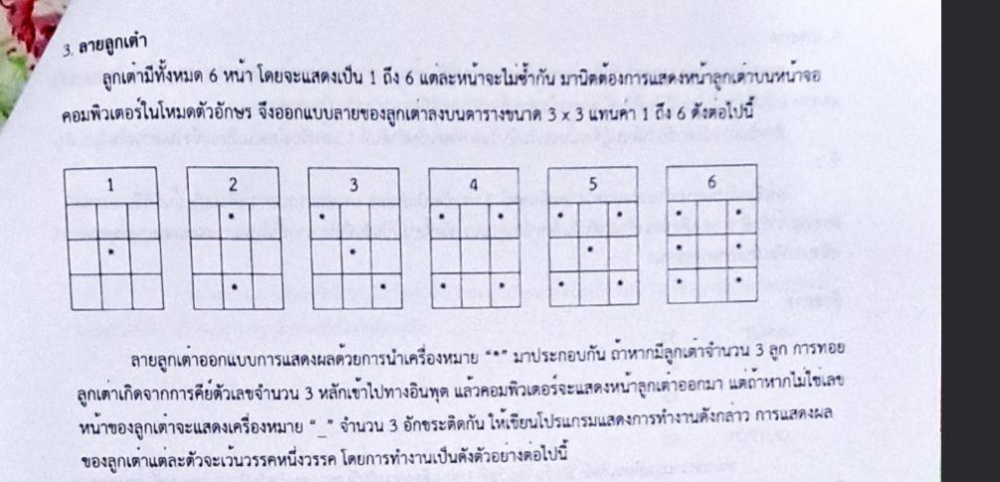

# [ข้อสอบท้ายค่าย 1 ศูนย์ สอวน.กรุงเทพมหานคร ปี 2566 ข้อที่ 3](https://grader.gchan.moe/problemset/c1_bkk66_3)

---

## Problem

### สรุปโจทย์

รับจำนวนเต็ม 3 หลัก จากนั้นแสดงผลเป็นหน้าของลูกเต๋า ตามเลข 3 ตัวนั้น


### สิ่งที่ต้องทำ

เขียนโค้ดเพื่อแสดงผลหน้าลูกเต๋าตามที่โจทย์กำหนด

!!! note "ตัวอย่าง"
    | Input      | Output                          |
    | ----------- | ------------------------------------ |
    | 351      |<pre style="margin-top: 0px; margin-bottom: 0px">*  * *   </pre><br><pre style="margin-top: 0px; margin-bottom: 0px"> *  *  * </pre><br><pre style="margin-top: 0px; margin-bottom: 0px">  ** *   </pre>|

!!! note "Prerequisites"
    - Arrays
    - Strings
---

## Solution

### วิธีทำ

เราจะเก็บว่าจำนวนใดหน้าตาเป็นอย่างไรในแต่ละบรรทัดและพิมพ์ผลลัพธ์ทีละบรรทัดให้ครบทั้ง 3 บรรทัด แล้วก็ไล่พิมพ์แต่ละตัวให้ถูกต้อง

---

### Code

```cpp title="posn1_66_bkk_p3.cpp"
#include <stdio.h>

int main(){
    int N;
    scanf("%d", &N);

    // ดึงค่าในแต่ละหลักออกมา
    int a, b, c;
    a = N / 100; b = N % 100 / 10, c = N % 10;
    if (!(a >= 1 && a <= 6)) a = 0;
    if (!(b >= 1 && b <= 6)) b = 0;
    if (!(c >= 1 && c <= 6)) c = 0;

    // เก็บรูปแบบของลูกเต๋าในแต่ละบรรทัด
    char dice[7][3][4] = {
        {
            "   ",
            "   ",
            "___"
        },
        {
            "   ",
            " * ",
            "   "
        },
        {
            " * ",
            "   ",
            " * "
        },
        {
            "*  ",
            " * ",
            "  *"
        },
        {
            "* *",
            "   ",
            "* *"
        },
        {
            "* *",
            " * ",
            "* *"
        },
        {
            "* *",
            "* *",
            "* *"
        }
    };

    // loop แล้วพิมพ์ออกมาโดยตรง
    for (int i = 0; i < 3; i++) printf("%s %s %s\n", dice[a][i], dice[b][i], dice[c][i]);
}
```
