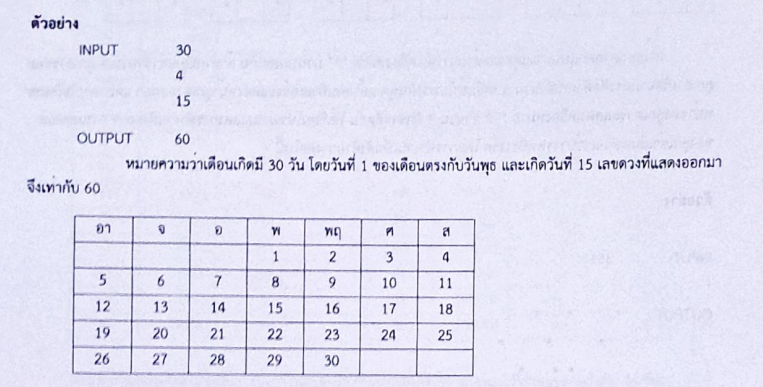

# [ข้อสอบท้ายค่าย 1 ศูนย์ สอวน.กรุงเทพมหานคร ปี 2566 ข้อที่ 4](https://grader.gchan.moe/problemset/c1_bkk66_4)

---

## Problem

### สรุปโจทย์

รับค่าจำนวนเต็ม 3 จำนวน จำนวนวันในเดือน วันแรกของเดือนคือวันอะไร (1 = วันอาทิตย์, 2 = วันจันทร์, ... 7 = วันเสาร์) และ วันที่ต้องการหาค่าดวง ซึ่งมีค่าเท่ากับผลรวมของวันที่ของช่องที่อยู่ติดกับวันนั้นๆ บนปฏิทิน

### สิ่งที่ต้องทำ

เขียนโค้ดเพื่อหาค่าดวงของวันนั้นๆ

!!! note "ตัวอย่าง"
    | Input      | Output                          |
    | ----------- | ------------------------------------ |
    | 30<br>4<br>15       |60|
    

!!! note "Prerequisites"
    - C/C++ Basics
---

## Solution

### วิธีทำ

ให้คอลัมน์ซ้ายสุดเป็นคอลัมน์ที่ 0 ถัดไปเป็น 1 ไปเรื่อยๆ<br>สังเกตว่าถ้าวันที่ 1 อยู่ในคอลัมน์ที่ $S$ แล้ววันที่ $N$ จะอยู่ในคอลัมน์ที่ $(N + S - 1)$ $\%$ $7$<br>จากนั้นใช้ `if-else` เพื่อเช็คว่า:

- หากวันที่ $S$ ไม่อยู่ในคอลัมน์ซ้ายสุดและ $S \neq 1$ ให้บวกค่าดวงด้วย $S-1$ และทำเช่นเดียวกันกับช่องทางด้านขวา
- ส่วนช่องด้านบน เช็คว่า ถ้าจำนวนนั้นมีค่ามากกว่า 7 ให้นำค่าดวงบวกด้วย $S - 7$ และทำเช่นเดียวกันสำหรับช่องด้านล่าง

---

### Code

```cpp title="posn1_66_bkk_p4.cpp"
#include <stdio.h>

int main(){
    int X, S, N;
    scanf("%d %d %d", &X, &S, &N);
    S--; // เนื่องจากข้อมูลนำเข้าอยู่ในรูปแบบ 1-indexed

    // หา column ในปฏิทินของวันที่ที่รับ input มา
    int col = (N + S - 1) % 7;
    int ans = 0;

    // if-else เพื่อคำนวณตรงๆ
    if (N > 7) ans += N - 7;
    if (N + 7 <= X) ans += N + 7;
    if (col > 0 && N > 1) ans += N - 1;
    if (col < 6 && N < X) ans += N + 1;
    
    printf("%d", ans);
}
```

