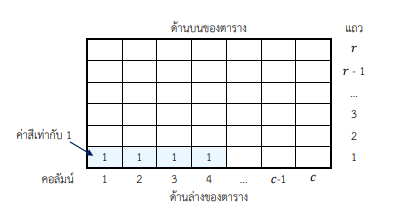
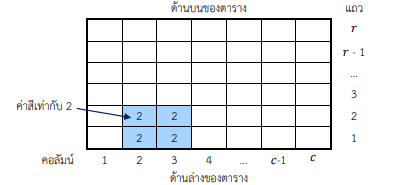
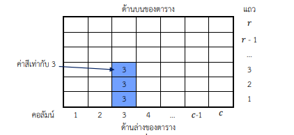
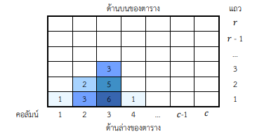
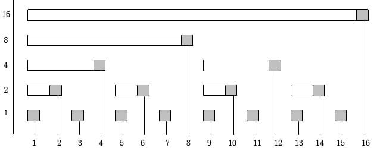
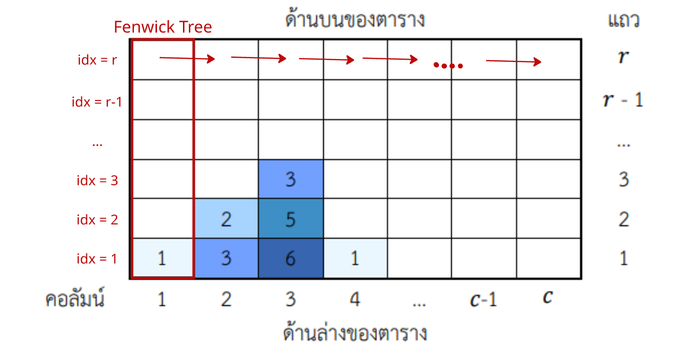

# คำอธิบายวิธีทำพร้อม code สำหรับข้อ [toi13_art](https://programming.in.th/tasks/toi13_art)
---
### **Author**: Nagorn Phongphasura
---

## **Problem**
---

### **สรุปโจทย์**

เราจะลงจุดสีจำนวน $N$ จุด โดยแต่ละครั้งที่ลงจุดจะมีข้อมูลดังนี้ : 

- ตำแหน่งที่ลงสี $(s_i)$
- ความสูงที่สีจะไหลขึ้นไป $(h_i)$
- ความกว้างที่ลงสี (นับรวมช่องที่ $s_i$) ด้วย $(w_i)$
- ค่าสี $(o_i)$ ซึ่งถ้าหากว่ามีการทับซ้อนของสีที่ลงในช่องใดๆ จะได้ว่า ค่าสีของช่องดังกล่าว จะเท่ากับ**ผลรวม**ของค่าสีทั้งหมดในช่องนั้น

---

### **สิ่งที่ต้องทำ**

นับจำนวนช่องที่มีค่าสีของช่องดังกล่าวเท่ากับ $T$

---

### **ตัวอย่าง**
พิจารณาภาพดังต่อไปนี้

การลงสีครั้งที่ 1 : $s_i = 1, h_i = 1, w_i = 4, o_i = 1 :$
{width="100%"}
การลงสีครั้งที่ 2 : $s_i = 2, h_i = 2, w_i = 2, o_i = 2 :$
{width="100%"}
การลงสีครั้งที่ 3 : $s_i = 3, h_i = 3, w_i = 1, o_i = 3 :$
{width="100%"}
เมื่อรวมทุกสีแล้ว จะได้ภาพดังต่อไปนี้ :
{width="100%"}

เมื่อพิจารณาภาพดังกล่าว พบว่า : 

- บริเวณที่มีค่าสีเท่ากับ 1 มีพื้นที่รวม 2 หน่วย
- บริเวณที่มีค่าสีเท่ากับ 2 มีพื้นที่รวม 1 หน่วย
- บริเวณที่มีค่าสีเท่ากับ 3 มีพื้นที่รวม 2 หน่วย
- บริเวณที่มีค่าสีเท่ากับ 5 มีพื้นที่รวม 1 หน่วย
- บริเวณที่มีค่าสีเท่ากับ 6 มีพื้นที่รวม 1 หน่วย

---

!!! note "Constraints"
    $1 \leq N \leq 10^5$<br>
    $1 \leq T \leq 10^7$<br>
    $1 \leq s_i \leq 3 \times 10^6$<br>
    $1 \leq h_i \leq 10^6$<br>
    $1 \leq w_i \leq 10^6$<br>
    $1 \leq i \leq N$<br>

!!! note "Prerequisites"
    - `Fenwick Tree`
    - `Binary Search`
    - `Sweep Line`

---

## **Solution**

---

### **Fenwick Tree (Binary Indexed Tree)**

**Fenwick Tree** จะทำการเก็บข้อมูล โดยจะให้ $fenwick_i$ เก็บเป็น ข้อมูลใน**ช่วง $2^n$ ที่ใหญ่ที่สุดที่ $2^n$ หาร i ลงตัว** ซึ่งจริงๆแล้ว $n$ นั้นก็คือ **bit สุดท้ายที่ถูก set ใน $i$ นั่นเอง**

โครงสร้างของ **Fenwick Tree** จะเป็นดังภาพนี้:

{width="100%"}

ปัญหาถัดมาคือ สำหรับค่าค่าหนึ่ง เราจะทำการ $update$ ยังไงดี นั่นคือ สมมติว่าเรากำลัง $update$ ช่องที่ $i$ เราจะหาช่องถัดไปที่ต้องมีค่าของ $i$ ยังไงดี **$($เช่น สมมติว่าเรา $update$ ช่องที่ $9$ เราจะต้องนำค่านั้นไปใส่ในช่องที่ $10, 12, 16$ ด้วย เพราะช่องเหล่านั้นกำลังทับซ้อนค่าของ $9$$)$**

จากที่เรารู้ว่า $fenwick_i$ จะเก็บ range ในช่วงที่ยาว $2^n$ เมื่อ $n$ คือ bit สุดท้ายของ $i$ **$($Least Significant Bit$)$** แล้วจบที่ $i$ เราได้ว่า $i$ จะเก็บ $[i - lsb(i) + 1, i]$

ซึ่งเราจะได้ว่า ค่าต่อไปที่เราจะต้อง $update$ คือ $j = i + lsb(i)$ โดยเราสามารถพิสูจน์ได้ว่า $j - lsb(j) \leq i$ ได้ง่ายๆ เพราะเนื่องจาก $lsb(i) \le lsb(j)$ เราจะได้ว่า $i = j - lsb(i)$ จะต้อง**มากกว่าหรือเท่ากับ** $j - lsb(j)$ นั่นเอง

คำถามต่อไปที่ตามมาคือ เราจะหา **Least Significant Bit** ของ $i$ ใดๆอย่างไรให้เร็วๆ

เนื่องจากเรารู้ว่า $-x$ ในเลขฐานสอง จะเท่ากับ $\sim x + 1$

เขียน $x$ ในรูปเลขฐานสอง จะได้ว่า $x$ สามารถเขียนได้ในรูป $??..100..00$ หรือ $\overline{a1b}$ เมื่อ $b = 00..00$<br>
เมื่อเขียน $-x$ ในรูปดังกล่าว จะได้ว่า $-x = \sim \overline{a1b} + 1 = \overline{a011..11} + 1 = \overline{a100..00}$<br>
และเนื่องจาก $a$ ที่อยู่ใน $-x$ เป็น $\sim$ ของ $a$ จะได้ว่า $x \& -x = LSB(x)$ นั่นเอง

สำหรับการ $update$ เราก็ $+= lsb(idx)$ ใช่มั้ย พอเป็น $query$ เราจะคำนวณเป็น **prefix** ก็แค่ $-= lsb(idx)$ นั่นเอง

โค้ดก็ง่ายๆเลย ตามนี้:

```cpp title="update.cpp"
void update(int idx, int val) {
    while (idx <= N) {
        fenwick[idx] += val;
        idx += idx & -idx
    }
}
```

```cpp title="query.cpp"
int query(int idx) {
    int sum = 0;
    while (idx > 0) {
        sum += fenwick[idx];
        idx -= idx & -idx;
    }
    return sum;
}
```

### **IDEA**

ในการทำข้อนี้ เราจะทำการพิจารณาตารางจากซ้ายไปขวา โดยจะใช้ `Fenwick Tree` ในการเก็บข้อมูลในแต่ละคอลัมน์ แล้วไล่จากซ้ายไปขวา

{width="100%"}

โดยเราจะทำให้ $query(idx)$ ของตัว Fenwick Tree ของเรา คืนค่ามาเป็นค่าสีในช่อง (แถว) ที่ $idx$ ในคอลัมน์ที่พิจารณาอยู่

สังเกตว่า เนื่องจาก Fenwick Tree ทำงานโดยการ $update$ ตั้งแต่ตำแหน่งเริ่มต้น จนช่องสุดท้าย สำหรับแต่ละสีในแต่ละ เราสามารถทำการ $update$ 2 รอบ นั่นคือ $update(1, o), update(h + 1, -o)$

ซึ่งโดยหลักการ Prefix Sum เมื่อเรา $query$ ตำแหน่งใดๆแล้ว หากความสูงดังกล่าวมันสูงกว่าตำแหน่งที่เกิดการ $update -o$ ไปแล้ว จะทำให้หักล้างกับตำแหน่งที่เรา $update +o$ ไป การ $query(idx)$ จึงได้ค่าสีในช่องดังกล่าวนั่นเอง

### **ISSUE**

แต่จะมีปัญหาเกิดขึ้น นั่นคือ การไล่จากซ้ายไปขวาตรงๆ และ $update$ ทุกสีในคอลัมน์นั้น จะช้าเกินไป เราจึงสามารถทำการ Optimize โค้ดได้โดยการใช้ [Sweep Line Algorithm](/problems/c2_kmutt_66_intersection/) ซึ่ง : 

1. เราจะใช้ `vector` ในการเก็บว่า สีแต่ละสี ถูกหยดลงไปในคอลัมน์ใดบ้าง ซึ่งข้อมูลที่จะเก็บก็จะเป็น $(\text{ตำแหน่ง}, \text{ความสูง}, \text{ค่าสี})$
    - ข้อมูลที่เราใส่เข้าไป จะเป็น $(s_i, h_i, o_i), (s_i + w_i, h_i, -o_i)$ เพื่อจะได้ทำลบสีเก่าออก

2. ทำการ $sort$ ข้อมูลตามตำแหน่ง เพื่อว่าเราจะสามารถ $sweep$ ตามข้อมูลใน `vector` ตามลำดับ
    - แต่ละรอบที่เรากวาด เราจะมีข้อมูล $(s, h, o)$ โดยในตัว Fenwick Tree เราจะต้องทำ $update$ 2 รอบ ได้แก่ $update(1, o)$ และ $update(h + 1, o)$ เพื่อให้ค่าสีหักล้างกัน ดังที่เคยกล่าวไว้

ตอนนี้ เราได้โครงสร้างของ solution ของเราเรียบร้อยแล้ว ปัญหาที่เหลือตอนนี้คือแค่หาจำนวนช่องที่จะมี**ค่าสี** $= T$

สังเกตว่า สมมติว่าตอนนี้เรากำลัง $update$ คอลัมน์ที่ $s_i$ แล้วไม่มีการ $update$ จนถึงคอลัมน์ที่ $s_{i+1}$ จะได้ว่า จำนวนช่องที่มีค่าสีเท่ากับ $T$ จะเท่ากับ **$($จำนวนช่องที่มีค่าสีเท่ากับ $T$ ในคอลัมน์ที่ $s_i)$ $\times$ $(s_{i+1} - s_i)$** (ในที่นี้ index ที่เราพิจารณา จะเป็น index ใน `vector` ใหม่ที่เราสร้างขึ้นมา และเรียงข้อมูลโดย $s$ เรียบร้อยแล้ว) 

### **Observation**

\[
    \forall j < i \mid query(j) \geq query(i)
\]

สังเกตได้ว่า เพราะการ $update$ จะทำจากด้านล่างเสมอ **(แถวที่ 1)** ทำให้สีใดๆที่อยู่ด้านบน จะต้องอยู่ด้านล่างด้วย ทำให้ด้านล่างมีการรวมของสีที่มากกว่าด้านบน จึงได้อสมการดังกล่าว

คำถามต่อมาคือ *"อสมการนี้สามารถช่วยให้เราแก้ปัญหานี้ได้อย่างไร"*

เราสามารถใช้ความจริงนี้ แทนที่จะไล่หาทุกช่องที่มี**ค่าสี** $= T$ เราสามารถใช้ [Binary Search](/problems/toi11_labor) ในการหาได้นั่นเอง โดยเราจะทำการ **Binary Search** หาตำแหน่งที่สูงที่สุดที่ $query(idx) = T - 1$ และหาตำแหน่งที่สูงที่สุดที่ $query(idx) = T$ และหาจำนวนช่องในช่วงนั้น จะได้จำนวนช่องในคอลัมน์ที่ $s_i$ ซึ่งมี**ค่าสี** $= T$ นั่นเองงง

---

## **Code**

```cpp title="TOI13_art.cpp"
#include <bits/stdc++.h>

using namespace std;

long long fenwick[1000005];

void update(int idx, long long num) {
    for (int i = idx; i <= 1000004; i += (i & -i)) {
        fenwick[i] += num;
    }
}

long long query(int idx) {
    long long sum = 0;
    for (int i = idx; i > 0; i -= (i & -i)) {
        sum += fenwick[i];
    }
    return sum;
}

int bsearch(long long t) {
    int l = 1, r = 1000001, ans = 0;
    while (l <= r) {
        int mid = l + (r - l) / 2;
        if (query(mid) <= t) {
            ans = mid;
            r = mid - 1;
        } 
        else {
            l = mid + 1;
        }
    }
    return ans;
}

int main() {
    cin.tie(NULL)->sync_with_stdio(false);

    // input
    int n;
    long long t;
    cin >> n >> t;

    // input + sweepline
    vector<tuple<long long, long long, long long>> events;
    for (int i = 0; i < n; i++) {
        long long s, h, w, o;
        cin >> s >> h >> w >> o;
        events.emplace_back(s, h, o);
        events.emplace_back(s + w, h, -o);
    }

    // เรียงการ update ตามคอลัมน์ (s)
    sort(events.begin(), events.end());

    long long ans = 0;
    for (int i = 0; i < (int)events.size() - 1; i++) {
        // ดึงค่า s[i], h[i], o[i]
        long long s = get<0>(events[i]);
        long long h = get<1>(events[i]);
        long long o = get<2>(events[i]);

        // update
        update(1, o);
        update(h + 1, -o);

        // ดึงค่า s[i + 1]
        long long ss = get<0>(events[i + 1]); 

        // เพิ่มค่าคำตอบ
        ans += (ss - s) * (bsearch(t - 1) - bsearch(t));
    }

    cout << ans;
}
```

!!! note "Total Time Complexity"
    $\mathcal{O}(n \log^2 n)$
