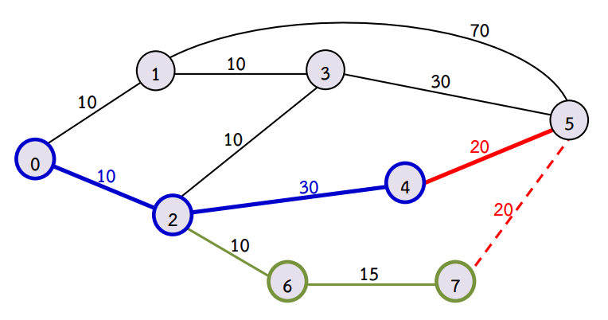

# คำอธิบายวิธีทำพร้อม code สำหรับข้อ [toi13_traveler](https://programming.in.th/tasks/toi13_traveler)
---
### **Author**: Nagorn Phongphasura
---

## **Problem**
---

### **สรุปโจทย์**

ในอาณาจักรหนึ่งมีเมือง $N$ เขตการปกครอง (ต่อจากนี้จะเรียกว่า **เมือง**) $(0$ ถึง $N-1)$ ซึ่งระหว่างแต่ละเมือง จะมีเส้นทางรถไฟฟ้าความเร็วสูง โดย สามารถเดินทางโดยใช้รถไฟได้ทั้งสองทาง

นักวิจัยคนหนึ่ง ต้องการเดินทางจากเมือง $X$ ไปยัง $Y$ แต่เนื่องจากเขามีงบจำกัด จึงเดินทางได้ไม่เกิน $Z$ กิโลเมตร โดยเขาจะเดินทางไปให้ใกล้กับเมือง $Y$ ให้ได้มากที่สุด (ก็คือ จะไปถึงเลย ไม่ก็หาเมืองที่ใกล้ที่สุด) แล้วให้เมือง $Y$ มารับเขาต่อ โดยหากมีเมืองที่ระยะทางจากเมือง $Y$ ไปยังเมืองดังกล่าวเท่ากัน ให้ตอบเป็นเมืองที่มีเลขกำกับเมืองน้อยที่สุด

---

### **ตัวอย่าง**
พิจารณาภาพดังต่อไปนี้ $(X = 0, Y = 5, Z = 40)$



จะเห็นได้ว่า นักวิจัยไม่สามารถเดินทางไปถึงเมือง $5$ ได้ จึงต้องเลือกเมืองที่ใกล้ที่สุด นั่นคือ เมืองที่ $4$ (เหตุผลที่ไม่เลือกเมืองที่ $7$ เพราะว่า เลข 4 มีเลขกำกับเมืองน้อยที่สุด)

---

### **สิ่งที่ต้องทำ**

หาระยะทางที่นักวิจัยจะเดินทางไปเมือง $Y$ โดยใช้งบน้อยที่สุด หากเดินทางไปไม่ได้ จงหาระยะทางจากเมือง $X$ ไปยังเมืองที่ทำให้ระยะทางต่อไปเมือง $Y$ มีค่าน้อยที่สุด

---

!!! note "Constraints"
    $2 \leq N \leq 10^4$ (จำนวนเมือง)<br>
    $1 \leq M \leq 10^5$(จำนวนเส้นทางรถไฟฟ้าความเร็วสูง)<br>
    $0 \leq X, Y < N, X \neq Y$ (เมืองเริ่มต้นและเมืองสิ้นสุด)<br>
    $1 \leq Z \leq 10^9$ (งบประมาณที่มี)<br>
    $0 \leq u_i, v_i < N$ (กำหนดเมืองที่เชื่อมของรถไฟฟ้าเส้นทางที่ $i$)<br>
    $1 \leq d_i \leq 10^4$ (ระยะทางของรถไฟฟ้าความเร็วสูงเส้นทางที่ $i$)<br>

!!! note "Prerequisites"
    - `Shortest Paths`

---

## **Solution**

---

### **Idea**
ถ้าหากว่าเราสามารถหาระยะสั้นสุดจากเมือง $X$ ไปเมืองอื่นๆทุกเมือง และจากเมือง $Y$ ไปเมืองอื่นๆทุกเมือง เราก็จะต้องทำต่อแค่ 2 ขั้นตอน ดังนี้

1. เช็กว่า ระยะสั้นสุดจากเมือง $X$ ไป $Y$ $\leq Z$ หรือไม่ หากใช่ ก็ตอบระยะทางดังกล่าวได้เลย
2. หากไม่ใช่ ก็ให้ loop ตั้งแต่เมือง $0$ ถึง $N - 1$ แล้วทำขั้นตอนดังต่อไปนี้ (กำหนดให้เมืองที่กำลัง loop อยู่ เป็นเมืองที่ $i$)<br> 
    - ตรวจสอบว่า ระยะทางจากเมือง $X$ ไปเมือง $i$ $\leq Z$ หรือไม่
        - **ไม่ใช่:** ข้ามไปได้เลย เพราะไม่ว่ายังไงก็ไม่สามารถเดินทางมาได้อยู่แล้ว
        - **ใช่:** ให้ตรวจสอบว่า ระยะทางจากเมือง $Y$ มายังเมือง $i$ มีค่าน้อยว่าระยะที่น้อยที่สุดที่เก็บเอาไว้หรือไม่ ถ้าใช่ ให้เก็บระยะต่ำสุดใหม่เป็นระยะจาก $Y$ มายังเมือง $i$ (นั่นคือ เลือกใช้เมือง $i$ เป็นเมืองที่จะเดินทางจาก $X$ มา แล้วให้เมือง $Y$ มารับ)

---

### **Dijkstra's Algorithm**
(อ่านว่า **"ไดยก์-สตร้า's-อัล-กอ-ริ-ทึม"**)

เป็นอัลกอริทึมที่ใช้สำหรับการหาระยะทางที่สั้นที่สุดจาก $1$ node (จุดยอด/เมือง) ไปยัง node อื่นๆทุก node **เมื่อ edge (เส้นเชื่อมระหว่าง node) ไม่มีค่าใดเป็นลบ**
**Time Complexity** ของ Dijkstra's Algorithm คือ $O((N + M)$ $log$ $N)$ เมื่อ $N$ คือจำนวน **node** และ $M$ คือจำนวน **edge**

**หลักการทำงานของ Dijkstra's Algorithm** จะอาศัยความ Greedy (เลือกวิธีที่ดีที่สุด ณ การเดิน เมื่ออยู่ที่เมืองใดเมืองหนึ่ง) มาประยุกต์ โดยขั้นตอนการทำงานจะเป็นดังนี้

1. **สร้างตัวแปรเก็บค่าที่จำเป็น**: ได้แก่
    - `priority_queue (min heap)` เก็บ `pair <int, nt>` $pq$ เป็น Data Structure ที่สามารถเก็บค่าเข้าไป และดึงค่าที่ต่ำ/สูงที่สุดออกมาได้ ซึ่งใช้เวลาเพียง $O(log$ $N)$ (นั่นคือ เราสามารถใส่ของเข้าไปเยอะๆ เป็นชนิดใดก็ได้ $(int, string, char, pair)$ โดยตัว `priority_queue` จะทำการจัดเรียงให้ แล้วเมื่อเรียก `pq.top()` ตัว `priority_queue` จะคืนค่ามาเป็น**ค่าน้อยสุด/ค่าสูงสุด**ที่เราเก็บเข้าไป ตามที่เราตั้งไว้ ในที่นี้ เราจะทำให้ $pq$ คืนค่าต่ำสุดมา) (อ่านเพิ่มเติมได้[ที่นี่](https://en.cppreference.com/w/cpp/container/priority_queue.html)) โดยข้อมูลแต่ละตัวใน $pq$ จะเก็บเป็น $pair$ โดยจะเก็บค่าเป็น \{**ระยะถึงเมืองที่เก็บ, เมืองดังกล่าว**\} ซึ่งจากสมบัติของ `priority_queue` ที่จะเรียงค่าให้จากน้อยไปมาก จะทำให้ค่าที่ดึงออกมาเป็นระยะที่สั้นที่สุดเสมอ
    - `array` $dis$ ทำหน้าที่คอยเก็บระยะที่สั้นที่สุดจาก node เริ่มต้นไปยัง node ใดๆ เริ่มต้นโดยการตั้งระยะทุกค่าเป็นค่าสูงๆ (เนื่องจากจะสมมติว่า ยังไม่สามารถเดินทางไปยัง node ใดๆ)
2. **ตั้งค่า**: ใส่ค่าใน $pq$ เป็น \{$0, X(เมืองเริ่มต้น)$\} แล้วตั้งค่าใน $dis[X]$ เป็น 0 (เนื่องจากระยะทางที่สั้นที่สุดจาก $X$ ไปยัง $X$ เท่ากับ 0)
3. **เริ่มดำเนินการทำงาน**: 
    1. ใช้ `while loop` โดยจะ loop เมื่อ `priority_queue` ยังมีของข้างใน (แสดงว่า การเดินทางยังไม่จบ อาจจะหาเส้นทางที่สั้นกว่าสำหรับบาง node ได้)
    2. หยิบ $pair$ ที่อยู่ด้านบนของ $pq$ ออกมา แล้วลบออกจาก $pq$ (กำหนดให้เป็น \{$w, u$\} แทนระยะทางและเมืองปัจจุบัน)
    3. loop ตาม node **เพื่อนบ้าน** ของ $u$ (นั่นคือ node ที่มี edge เชื่อมกับ $u$) กำหนดให้ node นั้น มีระยะเชื่อมกับ $u$ ยาว $ww$ และ เป็น node หมายเลข $v$
        1. ตรวจสอบว่า ระยะทางรวมปัจจุบัน รวมกับ ระยะจาก $u$ ไป $v$ สั้นกว่าระยะสั้นสุดที่หาเจอมาแล้วหรือไม่ $(w + ww < dis[v])$
        2. ถ้าหากว่าสั้นกว่า ก็ให้ใส่เข้าไปใน $pq$ และอัปเดตระยะทางสั้นที่สุดใน $dis$ เลย

**ตัวอย่าง Code:**
```cpp title="Dijkstra's Algorithm"
// Dijsktra's Algorithm
// 1. เตรียมตัวแปรต่างๆ
priority_queue <pii, vector <pii>, greater <pii>> pq; // การประกาศ priority_queue แบบ min_heap ซึ่งจะเรียงจากน้อยไปมากแทนที่จะเป็นมากไปน้อย
vector <int> dis(n, inf);
// 2. ตั้งค่า
dis[x] = 0;
pq.emplace(0, x);
// 3. ดำเนินการทำงาน
while (!pq.empty()) {
    auto [w, u] = pq.top(); // ดึงค่าด้านบน {ระยะทางรวม, เมืองปัจจุบัน}
    pq.pop(); // แล้วลบออก
    for (auto [ww, v] : adj[u]) {
        if (w + ww >= dis[v]) continue; // ตรวจสอบว่า ระยะทางรวม + เส้นทางใหม่ สั้นกว่าระยะทางที่สั้นที่สุดที่เคยเจอหรือไม่
        // ถ้าสั้นกว่า ก็ดำเนินการใส่ระยะใหม่ใน pq และอัปเดตค่าใน dis
        pq.emplace(w + ww, v);
        dis[v] = w + ww;
    }
}
```

เมื่อ loop สิ้นสุดการทำงาน เราก็จะได้ $dis$ ซึ่งจะเก็บระยะทางที่สั้นที่สุดนั่นเอง 

**สามารถดู Video เพื่อให้เข้าใจการทำงานของ Dijkstra's Algorithm ได้[ที่นี่](https://youtu.be/EFg3u_E6eHU?si=3ODo5eRbFpBCx6uT&t=69) (ขอขอบคุณวิดีโอจาก [Youtube: Spanning Tree](https://www.youtube.com/@SpanningTree))**

---

### **วิธีทำ**
เราสามารถใช้ [Dijkstra's Algorithm](#dijkstras-algorithm) โดยเริ่มต้นจากเมือง $X$ และเมือง $Y$ เพื่อหาระยะที่สั้นที่สุดไปยังเมืองต่างๆ แล้วทำตามขั้นตอนต่างๆที่เขียนไว้[ข้างบน](#idea)ได้เลยยยย

---

## **Code**

```cpp title="TOI13_Traveler.cpp"
#include <bits/stdc++.h>
#define int long long

using namespace std;

const int inf = 1e18;

int32_t main(){
    cin.tie(NULL)->sync_with_stdio(false);

    // input
    int n, m, x, y, z;
    cin >> n >> m >> x >> y >> z;
    vector <pii> adj[n];
    for(int i = 0; i < m; i++){
        int a, b, c;
        cin >> a >> b >> c;
        adj[a].emplace_back(c, b);
        adj[b].emplace_back(c, a);
    }

    priority_queue <pii, vector <pii>, greater <pii>> q;

    // Dijkstra's Algorithm on X
    vector <int> dis_x(n, inf);
    dis_x[x] = 0;
    q.emplace(0, x);
    while (!q.empty()) {
        auto [w, u] = q.top();
        q.pop();
        for (auto [ww, v] : adj[u]) {
            if (w + ww >= dis_x[v]) continue;
            dis_x[v] = w + ww;
            q.emplace(w + ww, v);
        }
    }

    // Dijsktra's Algorithm on Y
    vector <int> dis_y(n, inf);
    dis_y[y] = 0;
    q.emplace(0, y);
    while (!q.empty()) {
        auto [w, u] = q.top();
        q.pop();
        for (auto [ww, v] : adj[u]) {
            if (w + ww >= dis_y[v]) continue;
            dis_y[v] = w + ww;
            q.emplace(w + ww, v);
        }
    }

    if (dis_x[y] <= z) { // หากระยะจากเมือง X ไปเมือง Y มีค่าน้อยกว่าหรือเท่ากับงบประมาณ ก็ตอบออกไปได้เลย
        cout << y << ' ' << dis_x[y] << ' ' << 0; // พิมพ์เมือง Y, ระยะทางจากเมือง X ไปเมือง Y, ระยะจากเมือง Y ไปเมือง Y (ซึ่งคือ 0 นั่นเอง)
        return 0; // จบการทำงานของโปรแกรม
    }

    int node = 0, len = inf; // ตั้งระยะที่สั้นที่สุดเป็นค่ามากๆ (ในที่นี้ กำหนด inf เป็น 10^18)
    for (int i = 0; i < n; i++) {
        if (dis_x[i] <= z && dis_y[i] < len) { // ตรวจสอบว่า ระยะจากเมือง X น้อยกว่า Z หรือไม่ และตรวจสอบอีกว่าระยะจากเมือง Y มีค่าน้อยกว่าระยะที่น้อยที่สุดที่พบมาแล้วหรือไม่  
            node = i;
            len = dis_y[i];
        }
    }

    cout << node << ' ' << dis_x[node] << ' ' << dis_y[node]; // พิมพ์เลขเมืองที่จะเดินทางไปให้มารับ, ระยะจากเมือง X, ระยะจากเมือง Y
}
```

!!! note "Total Time Complexity"
    $O((N + M)$ $log$ $N)$
