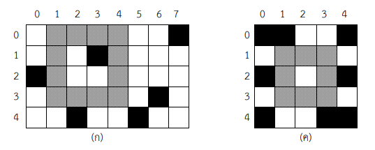
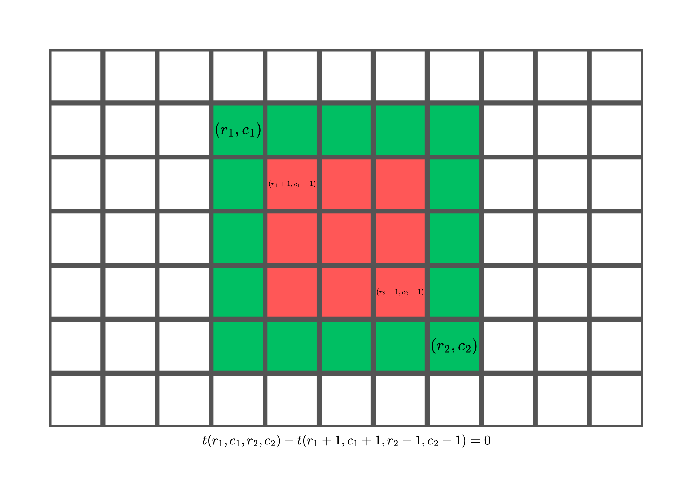
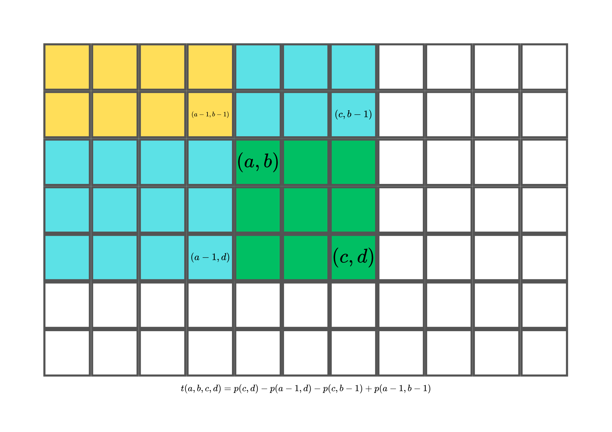
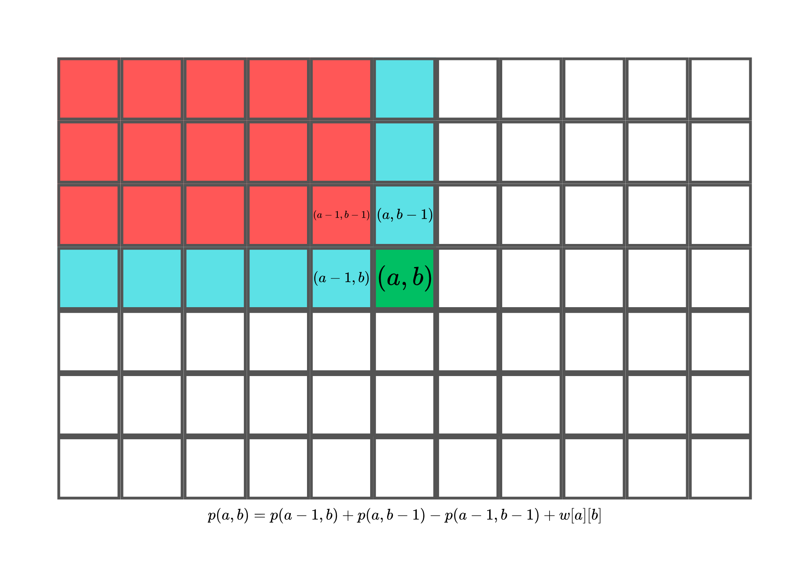

# คำอธิบายวิธีทำพร้อม code สำหรับข้อ [toi9_fence](https://programming.in.th/tasks/toi9_fence)
---
### **Author**: kaopj
---

## **Problem**
---

### **สรุปโจทย์**

มีสวนรูปสี่เหลี่ยมแห่งหนึ่ง ขนาด $N \times M$ ตารางหน่วย โดยในบางช่อง จะมีต้นไม้ปลูกอยู่ โดยมีรวมทั้งหมด $T$ ต้น และเราต้องการสร้างรั้วรูปสี่เหลี่ยมจัตุรัส ความหนา $1$ หน่วย โดยที่พื้นที่ที่เราสร้างรั้ว ไม่มีต้นไม้สักต้นเลย

---

### **สิ่งที่ต้องทำ**

หาความยาวด้านรั้วที่ใหญ่ที่สุดที่เราสามารถสร้างได้ โดยที่พื้นที่รั้ว ไม่มีต้นไม้เลย (สามารถมีต้นไม้ข้างในรั้วได้)

---

### **ตัวอย่าง**
พิจารณาภาพดังต่อไปนี้


{width="100%"}
<center>จากภาพ เป็นการแสดงการสร้างรั้วที่มีความยาวด้านมากที่สุด<br>(สีขาว = ไม่มีต้นไม้, สีดำ = มีต้นไม้, สีเทา = สร้างรั้ว)<br>ซึ่งสังเกตได้ว่า บริเวณที่สร้างรั้ว จะไม่มีต้นไม้เลย<br>ในกรณี (ก) จะต้องตอบว่า 4, และในกรณี (ค) จะต้องตอบว่า 3</center>


---

!!! note "Constraints"
    $2 \leq M,N \leq 500$ (ความกว้างและความยาวของสวน)<br>
    $1 \leq T \leq 10^5$ (จำนวนต้นไม้ในสวน)<br>

!!! note "Prerequisites"
    - `Brute Force`
    - `2D Prefix Sum`

---

## **Solution**

---

ให้พิกัด $(r,c)$ หมายถึงพื้นที่ในแถวที่ $r$ และคอลัมน์ที่ $c$

และให้ $w[r][c]=1$ ก็ต่อเมื่อมีต้นไม้ที่พิกัด $(r,c)$ ถ้าไม่มีต้นไม้ก็ให้ $w[r][c]=0$

โดยเราจะไล่พิกัดที่จะเป็นมุมซ้ายบนของเราทั้งหมด $NM$ ตัว และไล่ขนาดของสี่เหลี่ยมเป็น $min(N,M)$ ขนาด

เราจะได้ Time Complexity เป็น $O(NM\cdot min(N,M)f(N))$ โดยที่ $f(N)$ หมายถึงเวลาที่ใช้สำหรับรูปสี่เหลี่ยมจัตุรัสหนึ่ง

เห็นได้ชัดว่าถ้า $f(N)=min(N,M)$ จะทำให้ TLE แน่ๆ ดังนั้นเราต้องหาวิธีในการลดเวลาของ $f(N)$

และ $T(a,b,c,d)$ หมายถึงจำนวนต้นไม้ที่อยู่ในสี่เหลี่ยมที่มีพิกัดมุมซ้ายบนที่มีพิกัดเป็น $(a,b)$ และมุมขวาล่างเป็น $(c,d)$

สมมติว่าเราอยากรู้ว่ารั้วที่มีพิกัดมุมซ้ายบนที่มีพิกัดเป็น $(r_1,c_1)$ และมุมขวาล่างของรั้วเป็น $(r_2,c_2)$ ว่าสามารถสร้างได้หรือไม่
จะได้ว่า จะสร้างได้ก็ต่อเมื่อ $t(r_1,c_1,r_2,c_2)-t(r_1+1,c_1+1,r_2-1,c_2-1)=0$ **(นั่นคือ จำนวนต้นไม้ในพื้นที่ใหญ่ ลบด้วยพื้นที่เล็ก (ซึ่งผลลบก็คือจำนวนต้นไม้ในกรอบรอบๆ) เท่ากับ 0)**

{width="100%"}

เราแค่ต้องหาวิธีคำนวณ $t(a,b,c,d)$ แบบรวดเร็ว โดยสังเกตว่าถ้าเรากำหนดให้ $p[a][b]$ หมายถึง จำนวนต้นไม้ที่อยู่ในสี่เหลี่ยมที่มีพิกัดมุมซ้ายบนที่มีพิกัดเป็น $(1,1)$ และมุมขวาล่างเป็น $(a,b)$

จะได้ว่า $t(a,b,c,d)=p[c][d]-p[a-1][d]-p[c][b-1]+p[a-1][b-1]$ **(เนื่องจากพื้นที่สีเหลืองถูกลบ 2 รอบ จึงต้องบวกเข้าไปใหม่)**

{width="100%"}

และถ้าเราสังเกตอีกจะได้ว่า $p[a][b]=p[a-1][b]+p[a][b-1]-p[a-1][b-1]+w[a][b]$

{width="100%"}

ดังนั้นถ้าเรารู้ $p[a-1][b],p[a][b-1]$ และ $p[a-1][b-1]$ เราสามารถหา $p[a][b]$ ได้ทันที

โดยเราสามารถหา $p[a][b]$ ทั้งหมดได้โดยทำแบบนี้:

1. คำนวณหา $p[1][1],p[1][2],\cdots,p[1][m]$ ตามลำดับ
2. คำนวณหา $p[2][1],p[2][2],\cdots,p[2][m]$ ตามลำดับ
3. คำนวณหา $p[3][1],p[3][2],\cdots,p[3][m]$ ตามลำดับ

... n. คำนวณหา $p[n-1][0],p[n-1][1],\cdots,p[n-1][m-1]$ ตามลำดับ

ซึ่งสิ่งนี้ก็คือ **2D Prefix Sum** นั่นเองครับ (สามารถอ่านเพิ่มเติมได้[ที่นี่](https://usaco.guide/silver/more-prefix-sums) หรือ อ่านเกี่ยวกับ Prefix Sum ทั่วไปได้[ที่นี่](https://usaco.guide/silver/prefix-sums))

เท่านี้เราก็สามารถคำนวณ $p[i][j]$ และ $t(a,b,c,d)$ ได้อย่างรวดเร็วครับ

---

## **Code**

```cpp title="TOI9_Fence.cpp"
#include <bits/stdc++.h>

using namespace std;

int n, m;
vector <vector <int>> w(505, vector <int> (505)), p(505, vector <int> (505));

// คำนวณจำนวนต้นไม้ที่อยู่ในกรอบขนาด k โดยมี x,y เป็นมุมขวาล่าง
bool cal(int x, int y, int k){
    int p1, p2;
    p1 = p[x][y] - p[x - k][y] - p[x][y - k] + p[x - k][y - k];
    p2 = p[x - 1][y - 1] - p[x - k + 1][y - 1] - p[x - 1][y - k + 1] + p[x - k + 1][y - k + 1];
    return p1 == p2;
}

// Function ใช้ตรวจสอบว่า x, y มากกว่า k หรือไม่
bool valid(int x, int y, int k){
    if (x >= k && y >= k) return true;
    return false;
}

void solve(){
    // input
    cin >> n >> m;
    int t; cin >> t;
    // ตั้งค่าเป็น 0
    for (int i = 1; i <= n; i++) {
        for (int j = 1; j <= m; j++) {
            w[i][j] = p[i][j] = 0;
        }
    }
    // Mark เอาไว้ว่า มีต้นไม้ที่ตำแหน่งใดบ้าง
    for (int i = 0; i < t; i++) {
        int x, y;
        cin >> x >> y;
        x++, y++;
        w[x][y] = 1;
    }
    // คำนวณ 2D pix Sum หรือก็แค่ p[a][b] ตามคำอธิบาย
    for (int a = 1; a <= n; a++) {
        for (int b = 1; b <= m; b++) {
            p[a][b] = p[a - 1][b] + p[a][b - 1] - p[a - 1][b - 1] + w[a][b];
        }
    }
    // ตรวจสอบทุกๆ k ที่เป็นไปได้ และลองใช้ทุกๆ i,j เป็นมุมขวาล่างของกรอบขนาด j
    for (int k = min(n, m); k >= 2; k--) {
        for (int i = n; i > 0; i--) {
            for (int j = m; j > 0; j--) {
                if (valid(i, j, k)) {
                    if (cal(i, j, k)) { // ถ้าไม่มีต้นไม้ในตัวกรอบ ก็ตอบได้เลย
                        cout << k << "\n";
                        return;
                    }
                }
                else break;
            }
        }
    }
    cout << 1 << '\n'; // กรณีที่ไม่มีขนาด > 1
}

int32_t main(){
    int t; t = 2;
    while(t--) solve(); // เนื่องจากจะตรวจสอบ 2 สวน
}
```

!!! note "Total Time Complexity"
    $O(N \times M \times min(N, M))$
